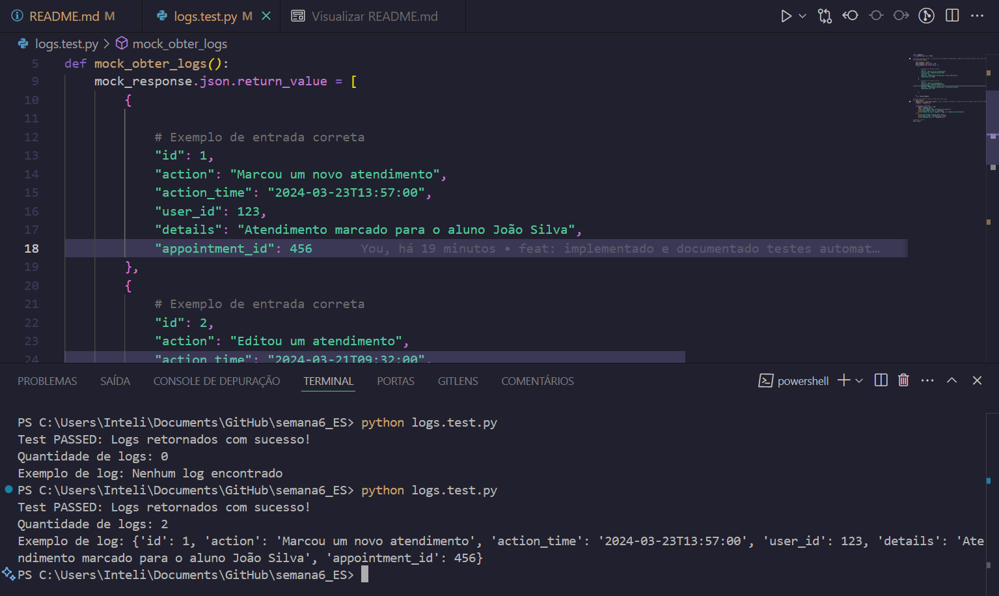
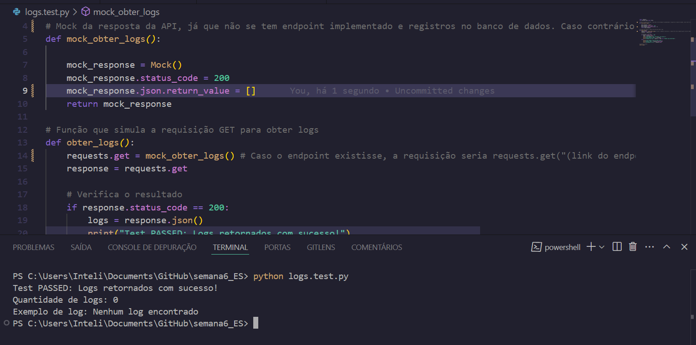

# Atividade de Programação - Semana 6 | 2025

Estudante: Nataly de Souza Cunha | T13 | G01

Professor: <a href="https://www.linkedin.com/in/jefferson-o-silva/">Jefferson de Oliveira Silva</a> 

## 🎯 Introdução

&ensp;Esta atividade pretende concretizar o aprendizado de Engenharia de Testes através da criação de Casos de Testes, os quais, segundo Craig e Jaskiel (2002), definem circunstâncias e condições específicas em relação a uma solução (software, hardware, etc.), as quais podem ser testadas a partir da definição de valores previstos de entrada, restrições para a uma determinada execução, bem como um resultado ou comportamento esperado.

&ensp;Abaixo, segue a tabela de Caso de Teste elaborada para esta atividade. Esta tabela relata a testagem da apresentação dos logs de uso do sistema desenvolvido para o Centro Paula Souza, registros os quais relatam todas as atividades executadas pelos usuários do sistema, relacionados aos atendimentos marcados pela Acessoria de Inclusão.

## **Caso de Teste: Validação do Endpoint de Logs**

| **Item**            | **Descrição**                                                                                   |
|----------------------|-----------------------------------------------------------------------------------------------|
| **ID do Teste**      | TC01                                                                                         |
| **Objetivo**         | Validar se o endpoint de `GET` dos logs retorna os dados corretamente e se todos eles são exibidos na página. |
| **Pré-condição**     | - O endpoint de logs deve estar disponível.   - O banco de dados deve conter registros de logs. |
| **Procedimento**     | 1. Enviar uma requisição GET para o endpoint de logs.   2. Verificar o retorno e a exibição na página. |
| **Resultado Esperado** | A API deve retornar status `200 OK` e os logs devem ser exibidos corretamente na página.       |
| **Resultado Obtido**  | [A ser preenchido após execução do teste]                                                     |
| **Pós-condição**     | Os logs devem estar visíveis na página, ordenados por data e hora. 

&ensp;A automatização desse teste está sendo feita com a biblioteca de requests do Python, em razão da facilidade oferecida pela stack e as funções direcionadas a esse objetivo. Neste mesmo repositório, o arquivo `logs.test.py` integra o código de automatização desta testagem. Apesar do endpoint de logs ainda não ter sido implementado e a tabela não possuir registros, espera-se que o teste consiga ser implementado através da simulação dos dados de entrada esperados, usando a biblioteca Mock.

## Como executar o teste?

1. No terminal, dentro da pasta raiz do respositório, execute esse comando para instalar as dependências necessárias:
- `pip install requests`
2. Execute o comando python logs.test.py para executar o teste.
3. Verifique o terminal para visualizar a resposta do teste. 

## Resultados

1. **Test PASSED**

| **Item**            | **Descrição**                                                                                   |
|----------------------|-----------------------------------------------------------------------------------------------|
| **ID do Teste**      | TC01                                                                                         |
| **Objetivo**         | Validar se o endpoint de `GET` dos logs retorna os dados corretamente.                        |
| **Pré-condição**     | - O mock da API foi configurado para simular uma resposta bem-sucedida.                       |
| **Procedimento**     | 1. Enviar uma requisição GET simulada para o endpoint de logs.   2. Verificar o retorno.   |
| **Resultado Esperado** | A API deve retornar status `200 OK` e uma lista de logs.                                      |
| **Resultado Obtido**  | **Test PASSED: Logs retornados com sucesso!**   Quantidade de logs: 2   Exemplo de log: `{'id': 1, 'action': 'Marcou um novo atendimento', 'action_time': '2024-03-23T13:57:00', 'user_id': 123, 'details': 'Atendimento marcado para o aluno João Silva', 'appointment_id': 456}` |
| **Pós-condição**     | Os logs foram retornados corretamente e estão no formato esperado.                            |

---

  Figura X - Resultado do teste de logs retornados corretamente   

  

  Fonte: autoria própria.

1. **Test PASSED com lista vazia de logs**

| **Item**            | **Descrição**                                                                                   |
|----------------------|-----------------------------------------------------------------------------------------------|
| **ID do Teste**      | TC02                                                                                         |
| **Objetivo**         | Captar quando o endpoint de `GET` consegue fazer o envio de dados, mas a lista está vazia.                     |
| **Pré-condição**     | - O mock da API foi configurado para simular uma resposta bem-sucedida.                       |
| **Procedimento**     | 1. Enviar uma requisição GET simulada para o endpoint de logs.   2. Verificar o retorno.   |
| **Resultado Esperado** | A API deve retornar status `200 OK` e uma mensagem informando que nenhum log foi encontrado.                                      |
| **Resultado Obtido**  | **Test PASSED: Logs retornados com sucesso!**   Quantidade de logs: 0   Exemplo de log: Nenhum log encontrado` |
| **Pós-condição**     | Os logs foram retornados corretamente e estão no formato esperado.                            |

---

  Figura X - Resultado do teste de uma resposta vazia de json (nenhum log encontrado)   

  

  Fonte: autoria própria.

## **Conclusão do Teste**

&ensp;O teste foi bem-sucedido, demonstrando que o endpoint de logs está funcionando conforme o esperado. Quando o mock da API retornou os dados corretamente, e a função de teste conseguiu processar e exibir as informações dos logs. Quando o Mock simulou uma entrada incorreta, o teste foi capaz de captar esse cenário e exibir o status de 'Test FAILED'.

## Referências

CRAIG, R.D., JASKIEL, S. P., “Systematic Software Testing”, Artech House Publishers, Boston, 2002. Acesso em 19 de março de 2025.